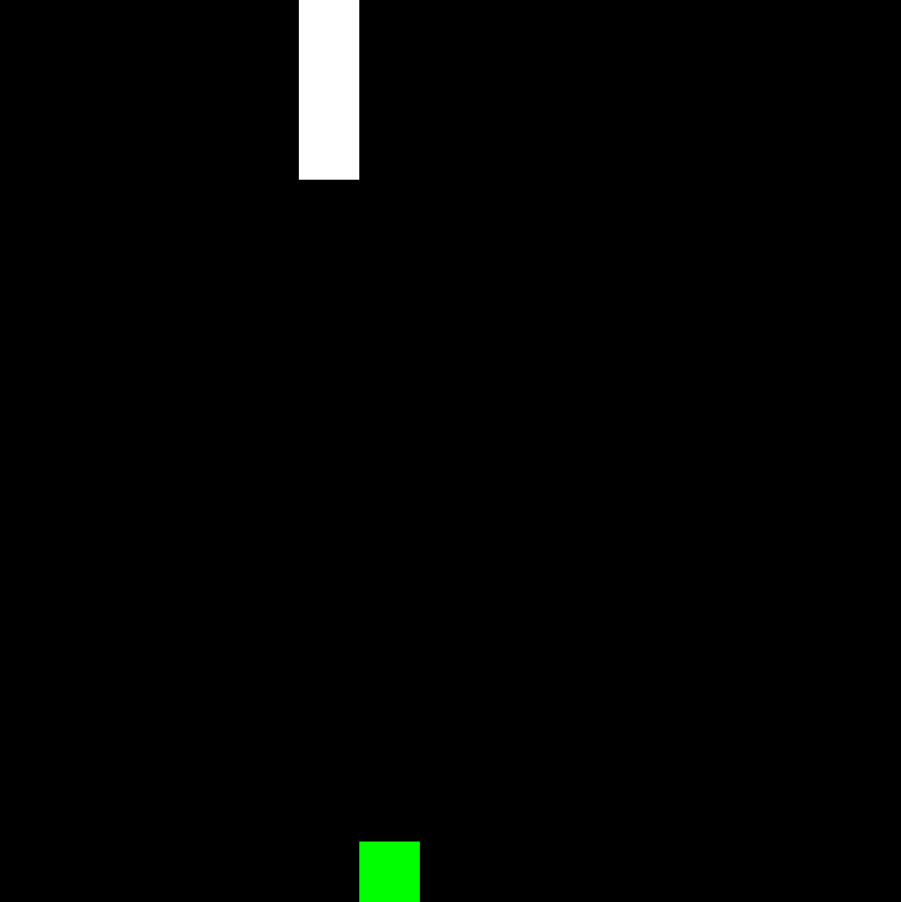

# snake

A simple library to play the classic game snake. Mostly a way for me to learn rust.




## Installation

This library depends on [csfml](https://www.sfml-dev.org/download/csfml/).


Arch:
```
sudo pacman -Syu csfml
```
Ubuntu:
```
sudo apt-get install libcsfml
```

To build yourself you will need the rust toolchain which you can get [here](https://rustup.rs/).
Clone the repository and then run the example `game`.
```
git clone https://github.com/jspspike/snake
cd snake
cargo run --example game
```
